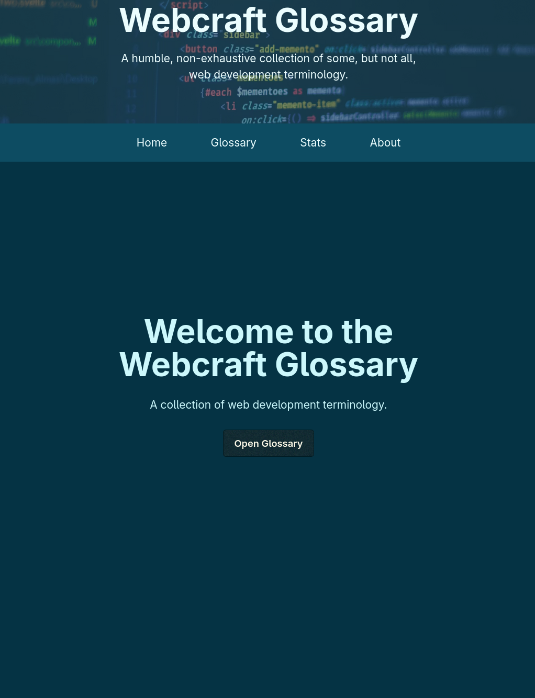
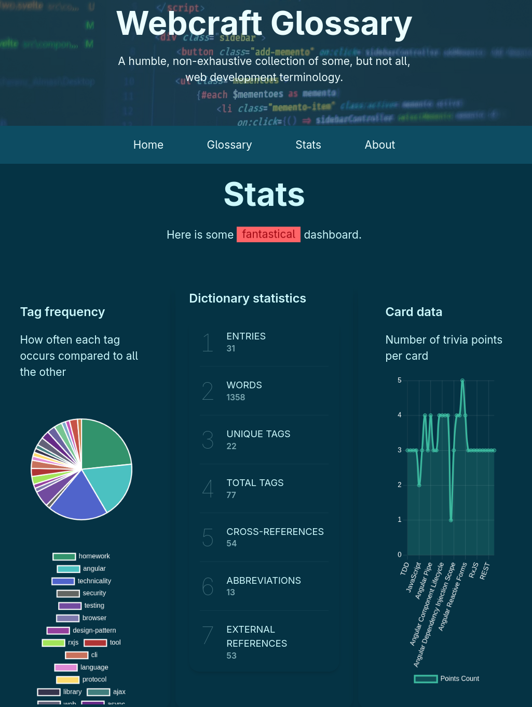
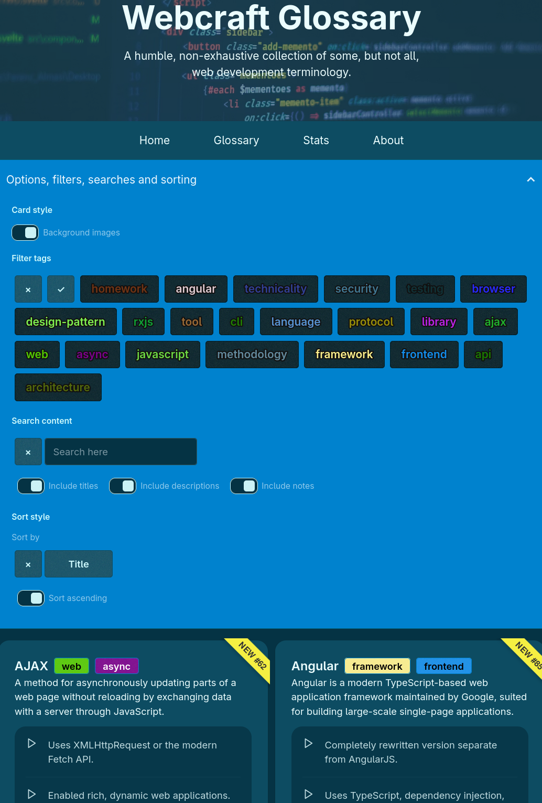
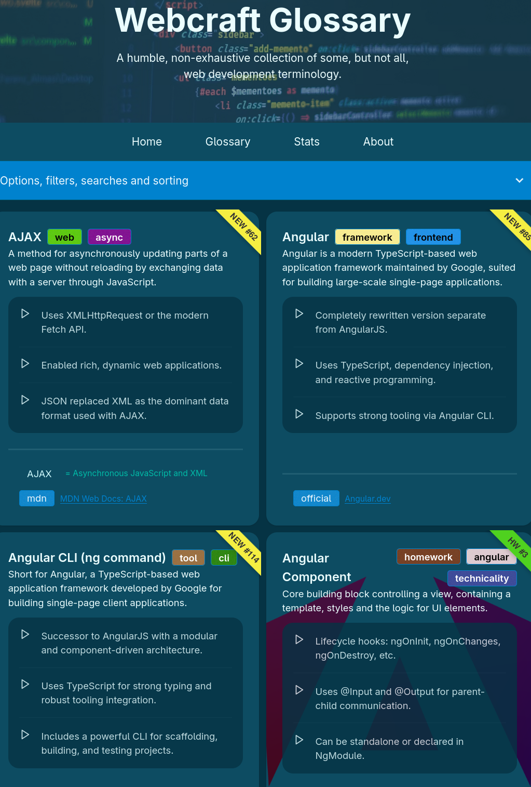

# Webcraft Glossary

## Demo Screenshots

|  |  |
|---|---|
|  |  |

## About

Link to the [Github Pages upload](https://kraasch.github.io/demo_webcraft_glossary/).

A project with...

  - [X] Angular 17,
  - [X] provide some filters,

<!--
task list:
  - [X] implement click and search for related terms,
  - [X] write more stats.
  - [x] implement sorting,
  - [X] have a visually more appealing sort-by drop down.
  - [X] solve issue: do not scroll past footer,
  - [ ] write more entries.
  - [ ] upload to Github Pages,
 -->

## Credits

  - Favicon from [icon8.com](https://icons8.com/icon/17857/sailing-boat/).
  - Home screen picture from [unsplash.com](https://images.unsplash.com/).
  - Card backgrounds from [Wikimedia Commons](https://commons.wikimedia.org/w/index.php).

## Interesting Docs

  - Read about [implied end tags](https://html.spec.whatwg.org/multipage/parsing.html#closing-elements-that-have-implied-end-tags).
  - About tailwind's [min-h utilities](https://windframe.dev/tailwind/classes/tailwind-min-height).
  - The pie chart's color scheme is the [Sweet Things Palette](https://lospec.com/palette-list/sweet-things).

